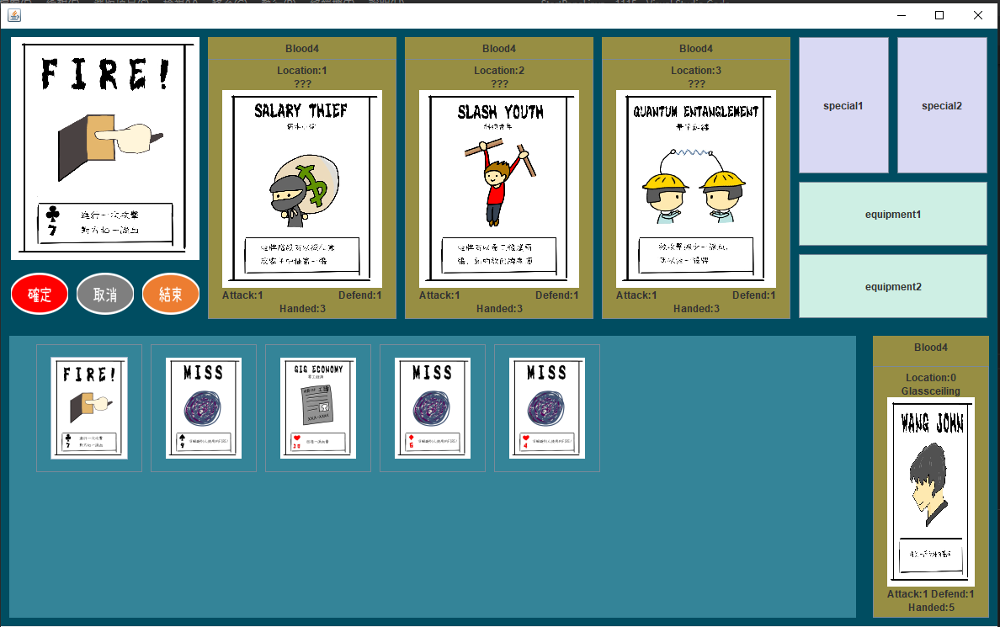

## Motivation
My group members and I believe that board games should not be limited by their form. Instead, they can show up in a novel way by turning them into computer games. Therefore, from 2020 September to 2020 December, we designed a computer game which concepts were adapted from the board game called "Bang!".

## Implementation

We implemented game functions and events with Java programming. Moreover, we designed and visualized the GUI interface of the game. All the elements including card descriptions, roles, and illustrations were designed by ourselves. We looked forward to raising awareness about issues such as worker tights and job quality in a more engaging way.

## Resource

To download the game and know more details about the game instructions, welcome to visit my [Github](https://github.com/wangjohn5507/OOPII_Final_Project).

