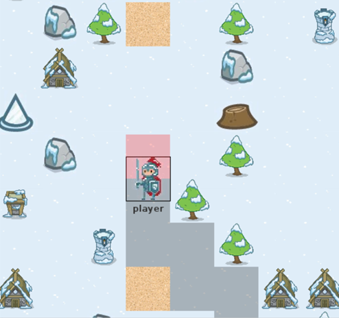

## Motivation
To familiar with algorithms including DFS, BFS, and UCS, the objective of the project was designing a simple GUI interface and simulated the movement strategy in League of Legends.

## Implementation

By entering different commands, the soldier will move to the destination without colliding with obstacles based on different path searching algorithms. This project totally divided into seven checkpoints to accomplish it.

## Resource

To download the project and know more details about the project, welcome to visit my [Github](https://github.com/wangjohn5507/OOPII_Project).

