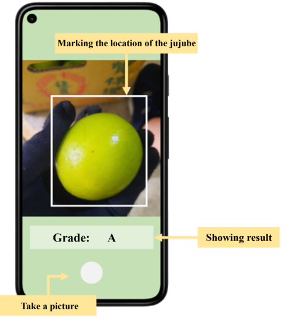

## Motivation

Continuing previous [research](../../publication/conference-paper/) ([Paper published in TAAI'21](./conference-paper.pdf)), this project is my graduation project, which used Machine Learning techniques to solve the agricultural workforce scarcity problem that severly affects Taiwan's agriculture industry. My group member and I discovered that the advancement in cities provides more job opportunities and higher salaries that attract young people to move from the countryside to cities. As a result, agricultural labour has gradually decreased in recent years, posing a massive crisis to Taiwan's agricultural industry. Therefore, we focused on the issue of labour shortages when classifying date grades in the harvest season.

## Approach

I successfully extracted dates and injured parts from images by training two layers of the YOLOv4 model. Then, I divided dates into different grades with the EfficientNet that was trained with multiple data such as injured area percentage and ingury cause weight.

## Deployment

Considering the practical situation, agricultural workers cannot afford expensive equipment. Thus, I used Flutter to design a smartphone application that allows people to use our service conveniently. We presented our result as a domestic conference paper and received many positive feedbacks. Besides, our prominent performance and outstanding work earned us 2nd prize in the Graduation Project Competition.

## Resource

To download the project and know more details about the project, welcome to visit my [Github](https://github.com/wangjohn5507/pickupchoose).

