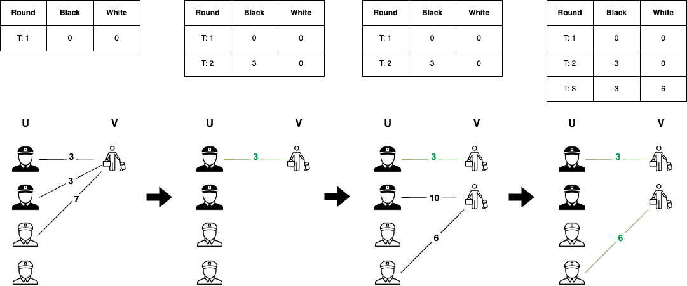
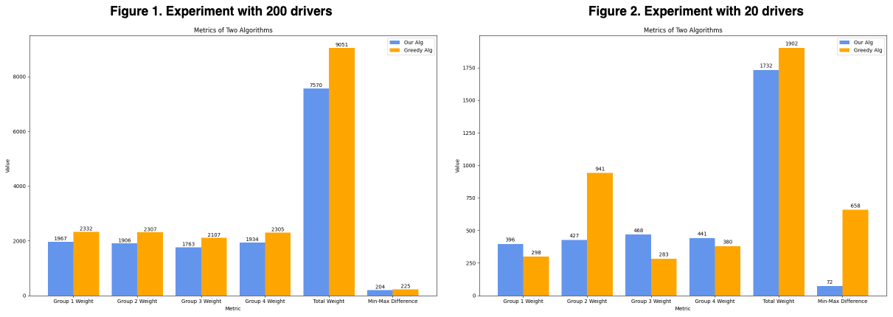

## Motivation

Services like Uber and Uber Eats can be modeled as online bipartite matching problems because they involve dynamically matching two sets of participants—drivers (or delivery personnel) and customers—in real-time. In this model, customers requesting rides or placing food orders arrive over time and need to be immediately matched with available drivers or couriers, considering factors like proximity and availability. This mirrors the online bipartite matching problem where decisions must be made without knowledge of future requests, making it a relevant framework for understanding and optimizing the efficiency of such services.

However, we observed that many successful algorithms emphasize a balance between fairness and efficiency, often employing greedy algorithms. Drawing inspiration from these findings, we have proposed a new algorithm called Priority-Update-Match, which ensure fairness among different groups.

## Approach
In the Uber scenario, this algorithm functions by keeping all driver groups organized in a priority queue based on factors like current demand and driver availability. When a new rider requests a ride (vertex v), the system first looks at the driver groups with the lowest priority values—typically areas with the most available drivers or least demand. Within these groups, it ranks all potential drivers (vertices u′ ∈ U) in descending order based on suitability factors such as proximity, estimated pick-up time, and driver ratings (edge weights). The system then attempts to match the rider with the best available driver. If a suitable match is found, they are paired, and the group's priority value is increased to reflect the added workload. If no match is found in the initial group, the system proceeds to groups with higher priority values (areas with fewer available drivers or higher demand). If no match can be made after checking all groups, the rider's request is dropped. Finally, the priority queue is updated to represent the new state of driver availability and group priorities.

## Example

For instance, consider two groups of drivers, Black and White. When a passenger requests a ride at time T: 1, our algorithm will first prioritize matching drivers from the group with the lowest priority value (at T: 1, both groups have the same priority). The algorithm matches the passenger with a driver from the appropriate group based on factors like proximity, with a matching weight of 3. After the match, the priority value of the group is updated by adding the weight of the match (weight = 3). At time T: 2, another passenger requests a ride. Even though the match with a driver from the Black group would yield a higher weight (weight = 10), the algorithm selects a driver from the White group because it has a lower priority value, ensuring fairness between groups. The priority value of the White group is then updated with the weight of the match (weight = 6). This approach maintains fairness between groups while performing online bipartite matching.

## Experiments

For our experiment, we set the number of groups to be 4, with each group containing 25 drivers, resulting in a total of 100 drivers. We conduct two experiments: one with 200 passengers to ensure maximum matching opportunities, and another with only 20 drivers, simulating a scenario where resources are limited. This setup allows us to assess the performance of our algorithm under different scenarios, varying the number of drivers available for matching.

The Figure 1 shows that **both our algorithm and the greedy algorithm can achieve fair matching when there are sufficient passengers**. When enough passengers are available, nearly every driver can obtain their most desired passengers, resulting in a higher total weight. 

The Figure 2 shows that **our algorithm achieves better fairness among different groups** when not enough passengers are available. This highlights the advantage of our algorithm, which consistently ensures fairness among different groups. Moreover, this scenario, where the number of items (passengers in this case) is restricted, is more reflective of real-life situations. For instance, in reality, job applicants often encounter limited job opportunities, making it challenging to secure ideal positions.

## Resource

To review the paper and know more details about the project, welcome to visit my [Github](https://github.com/wangjohn5507/Fairness_Online_Bipartite_Matching).

