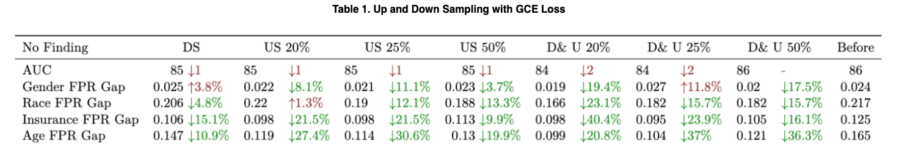

## Motivation

In this project, we investigate how bias in machine learning models, particularly those used in medical image analysis, can lead to unfair outcomes across various demographic subgroups. We focus on chest radiograph datasets and highlight the necessity of fairness in medical AI, especially considering the significant implications bias can have on healthcare decisions. The motivation behind the work stems from well-documented cases of racial, gender, and socioeconomic disparities in the performance of AI models used for disease prediction. These biases can exacerbate existing healthcare inequities, particularly in underrepresented populations. Our goal is to mitigate these biases through preprocessing techniques to improve fairness in model outcomes.

## Approach

The approach employed in this project involves **the use of Generalized Cross Entropy (GCE) Loss to identify biased data points within the dataset**. By analyzing the loss associated with each data point, the paper introduces upsampling and downsampling strategies to correct biases. Upsampling involves increasing the representation of data points from subgroups with higher false positive rates (FPR), while downsampling removes data points that disproportionately benefit from lower FPR. These methods were applied to mitigate bias within the model’s training process, allowing for more equitable outcomes. Additionally, we compare the use of GCE Loss with Binary Cross-Entropy (BCE) Loss to evaluate the impact of different loss functions on bias mitigation.

## Experiments

Experiments were conducted on the MIMIC-CXR dataset, which includes demographic attributes like race, gender, age, and insurance type. The project utilizes both GCE and BCE Loss across multiple subgroups to evaluate the effectiveness of upsampling and downsampling techniques. The performance of the models was evaluated using the Area Under the Curve (AUC) and FPR metrics. The experiments reveal that combining upsampling and downsampling strategies effectively reduces the FPR gap across subgroups. The results of these experiments were presented in tables to demonstrate the impact of bias mitigation across various sensitive attributes and the effectiveness of different sampling strategies.

## Results

The results indicate that **applying a combination of 50% upsampling and downsampling using GCE Loss leads to a significant reduction in bias, as reflected by the narrowing of the FPR gap without a substantial decrease in AUC performance (Table 1 and Figure 1)**. Moreover, we observed that **targeting specific sensitive attributes, such as age, proved to be particularly effective in reducing bias (Table 2)**. In conclusion, the project provides a promising approach for mitigating bias in medical image datasets, although we note some limitations, including the need for further exploration of additional datasets, loss functions, and validation techniques to ensure the generalizability of our approach.

## Resource

To review the paper and know more details about the project, welcome to visit my [Github](https://github.com/wangjohn5507/Debias-medical-images). Due to dataset access restrictions, we are unable to publicly share the dataset used in our experiments.

