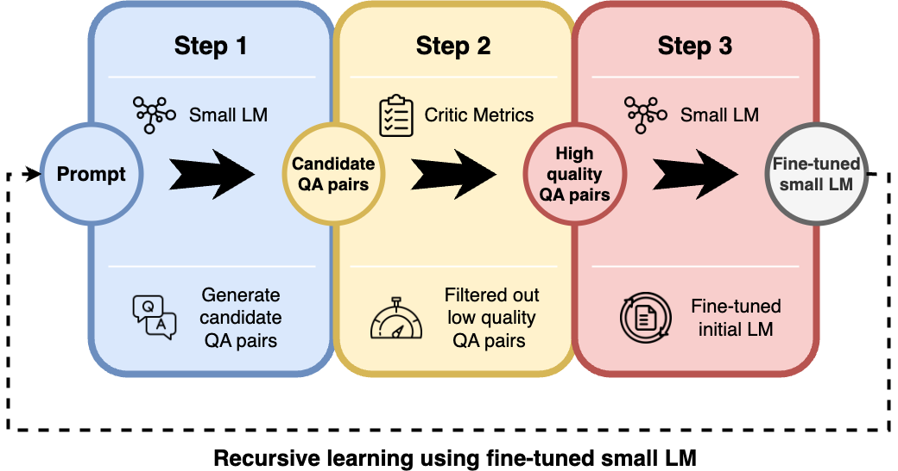
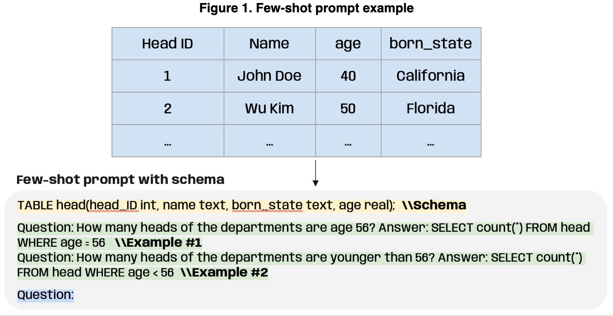
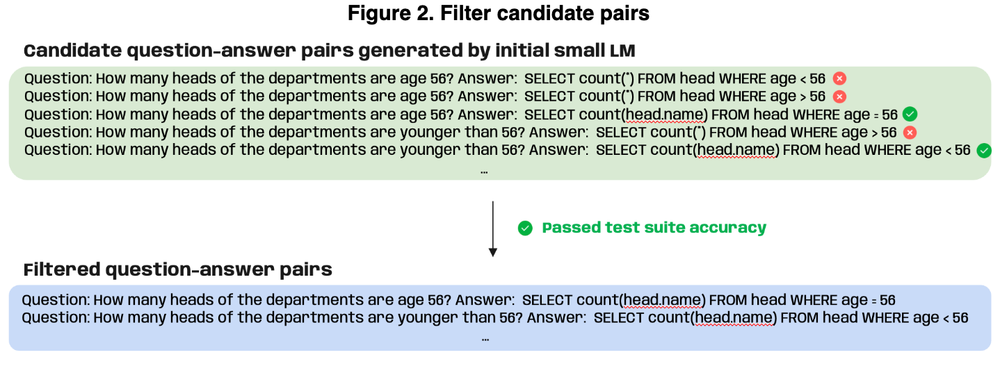
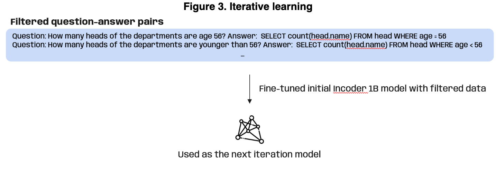

## Motivation

In this project, we present a novel approach to tackling the challenge of translating natural language into SQL queries using smaller language models. The motivation stems from the growing demand for large language models in tasks such as Text-to-SQL, where users can interact with databases using natural language. While large models like GPT-3 and T5 show promise, their training requires significant human effort and high computational costs, making them less accessible for many. To address this, the study proposes using smaller models and recursive distillation to reduce the need for human intervention and lower computational expenses.

## Approach

The proposed approach relies on a three-step framework designed to automate the training process. First, the model generates multiple question-answer (QA) pairs based on few-shot prompts. In the second step, critic metrics are applied to filter out low-quality question-answer pairs. Finally, the filtered data is used to fine-tune the small language model, which is then iteratively refined through recursive distillation. The primary model used is Incoder-1B, though the framework allows flexibility to incorporate any model pretrained on code. This recursive learning approach helps the model self-learn to improve performance in generating SQL queries without requiring large-scale, human-annotated datasets.

## Experiments

In the experimental section, we apply their framework using the SPIDER dataset, which contains over 5,000 unique SQL queries across multiple databases. Execution accuracy and test-suite accuracy are used as the main critic metrics to evaluate the quality of the generated SQL queries. The process involved generating SQL queries for a set of natural language questions, and those that did not meet the thresholds were filtered out. This method showed that even small language models could achieve a high level of performance in Text-to-SQL tasks when trained effectively using recursive distillation.

## Examples

**The first use case illustrates the construction of a few-shot prompt template based on a given database schema and associated natural language questions (Figure 1)**. This standardized prompt helps to ensure consistent quality in the candidate question-answer pairs generated by the model. The authors show that by providing the model with the database schema and a few examples of questions and SQL queries, the small language model can effectively generate SQL queries for new questions.

**The second use case highlights the use of critic metrics—execution accuracy and test-suite accuracy—to filter out low-quality SQL queries (Figure 2)**. After generating multiple candidate question-answer pairs from the prompts, the system applies these metrics to discard incorrect or non-executable SQL queries. This filtering ensures that only high-quality data is used to fine-tune the small language model in subsequent iterations.

**The third use case demonstrates how the recursive distillation process works for improving the Text-to-SQL performance of a small language model like Incoder-1B (Figure 3)**.

Overall, the use cases demonstrate the practical application of the framework in reducing human involvement in training and enhancing the performance of small language models on Text-to-SQL tasks. The process of recursive distillation, combined with critic metrics, allows the model to iteratively improve its SQL generation capabilities in an automated manner.

## Resource

To review the paper and know more details about the project, welcome to visit my [Github](https://github.com/wangjohn5507/Distillation-with-small-LM).
