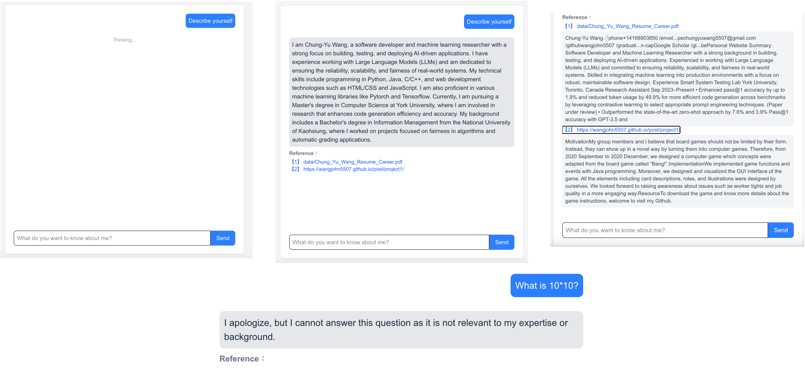

## Motivation

The motivation behind this project stems from my desire to offer a more engaging and personalized way for visitors to learn about me beyond a static resume or bio. By integrating a custom AI assistant into my personal website, powered by Retrieval-Augmented Generation (RAG) and my own documents, I aim to create an interactive experience where users can ask questions and receive accurate, conversational answers about my background, skills, and experiences. This not only demonstrates my technical capabilities in building full-stack AI applications, but also reflects my passion for creating intuitive, human-centered technology. You can play around the application with the link: https://insightme.site/assistant.

## Approach

This project leverages a Retrieval-Augmented Generation (RAG) approach, combining the power of OpenAI’s GPT-3.5 language model with Langchain and Pinecone for document retrieval. First, my personal documents—such as my resume—are indexed using embedding-based vector search. When a user submits a question, the system first evaluates its relevance, then reformulates it if necessary to a standalone version using a rephrasing prompt. Relevant document chunks are then retrieved from the vector store and passed along with the user’s question to the language model, which generates a contextualized, conversational response. It is worth noting that the system also integrates memory, allowing it to retain the chat history between the user and the chatbot. This conversational context is used as a reference for the language model, enabling it to generate more accurate and contextually relevant responses based on the user’s previous questions. This memory mechanism enhances the overall coherence and continuity of the interaction, creating a more natural and personalized user experience. The entire pipeline is orchestrated using LangGraph, and deployed as a full-stack application with a FastAPI backend and a clean Next.js frontend.

## Examples

The first use case illustrates the process initiated when a user submits a question—the chatbot begins by retrieving relevant documents and generating a response. The second use case demonstrates the chatbot's ability to produce a coherent and informative answer based on the retrieved content. The third use case highlights the system’s transparency, as it provides clickable references to the source documents used during the retrieval process, allowing users to explore the original context behind the response. The final use case showcases an additional layer of filtering implemented before answer generation. If a question is deemed unrelated or irrelevant to my background or expertise, it is intercepted and not forwarded to the language model. This ensures that the chatbot remains focused, avoids off-topic responses, and maintains alignment with the purpose of the assistant—providing accurate and meaningful insights about me.

## Resource

To review the project, welcome to visit my [Github](https://github.com/wangjohn5507/insightme).
